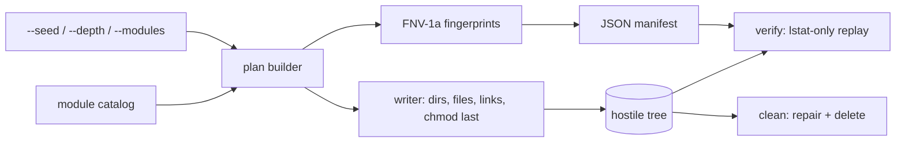

# fswreck

[English](README.md) | [中文](README.zh.md) | [日本語](README.ja.md)

[](LICENSE) [](Cargo.toml)  [](CONTRIBUTING.md)

**オープンソースの敵対的ファイルシステム生成器 — 対抗的なファイルツリー（Unicode ファイル名、シンボリックリンク循環、超深層ネスト、奇妙なパーミッション）を決定論的に構築し、再利用・検証可能なテストフィクスチャにする。**


```bash
git clone https://github.com/JaydenCJ/fswreck.git && cargo install --path fswreck
```

## なぜ fswreck？

ファイルを扱うコードは開発者の整ったホームディレクトリでは常に動き、現場で壊れる：NFC/NFD の双子ファイル名を持つ写真ライブラリ、シンボリックリンク循環を含む node_modules、`-rf` という名前のファイルがある作業ディレクトリ、mode-000 ディレクトリを含むバックアップ元。よくある二つの対策はどちらも不十分 — 手作りのテストディレクトリは作者が覚えていた三例しかカバーせず（しかも git checkout に静かに壊される。git は FIFO も空ディレクトリも表現できない）、ファイルシステムファザーはクラッシュは見つけるが毎回違うツリーを生み、検証の基準を残さない。fswreck はその隙間に立つ：実世界の故障モード 317 件を精選したカタログを、シードからバイト単位で同一に生成し、JSON マニフェストに記録、ツール実行後に `fswreck verify` が再検証する — 「敵対的ツリーに耐える」が逸話ではなく回帰テストになる。

|  | fswreck | 手作りテストディレクトリ | fsstress (xfstests) | プロパティベースファジング |
|---|---|---|---|---|
| シードから再現可能 | はい、バイト単位で同一 | 対象外（静的） | いいえ（ランダム操作） | 再生にフレームワークが必要 |
| 精選された既知の危険ケース | 6 モジュール 317 件 | 作者が覚えていた分だけ | いいえ（ランダム操作） | いいえ（ランダム） |
| 不正 UTF-8 / RTL / NFC-NFD 名 | あり | git でほぼ生き残れない | なし | エンコーダ依存 |
| リンク循環 + ELOOP チェーン | あり | 手作業では危険 | なし | ほぼモデル化されない |
| mode-000 / 書き込み専用の罠 | あり、安全に撤去可能 | `rm -rf` が詰まる | なし | なし |
| 実行後の完全性チェック | `fswreck verify` | 手動 diff | なし | 自前のアサーション |
| 依存関係 | 0（std のみ） | — | xfstests 一式 | テストフレームワーク |

## 特徴

- **1 コマンドで 317 個の罠** — `fswreck generate ./wreck` が 6 モジュールの精選故障モードを実体化：紛らわしい Unicode、フラグ風ファイル名、リンク循環、2 KiB 深のパス、パーミッションの罠、そして特殊 inode（FIFO、ハードリンク、スパース、空）。
- **バイト単位の決定論** — ファイル内容は `seed XOR fnv1a64(path)` から導出；同じシードはどのマシンでも同一のツリーとマニフェストを再現し、フィクスチャは共有でき diff にも意味が出る。
- **破壊の後に検証** — マニフェストは種別・モード・サイズ・内容フィンガープリント・リンク先・共有 inode を記録；`fswreck verify` がそれを再生し、削除・モードのずれ・リンク付け替え・想定外のファイルを漏れなく報告 — 終了コード 1 はツールが何かを壊した印。
- **リンクは絶対に辿らない** — 全チェックは `lstat`/`readlink` のみ。循環も脱出リンクも無害化され、悪意あるマニフェストでも fswreck にフィクスチャ外を触らせることはできない。
- **本当に使える撤去** — `fswreck clean` は削除前に mode-000 ディレクトリを修復し（素の `rm -rf` は詰まる）、自分が生成していないディレクトリは強制しない限り削除を拒否。
- **依存ゼロ・ネットワークゼロ** — PRNG もハッシュも JSON パーサも含め std のみの Rust；fswreck はローカルファイルの読み書き以外何もしない。

## クイックスタート

インストール（Rust 1.75+、Linux または macOS が必要）：

```bash
git clone https://github.com/JaydenCJ/fswreck.git && cargo install --path fswreck
```

敵対的ツリーを生成し、ツールを走らせ、何が生き残ったか確認する：

```bash
fswreck generate ./wreck
your-backup-tool ./wreck /mnt/restore   # the code under test
fswreck verify ./wreck && echo "fixture intact"
```

出力（実際の実行から採取、シード 42）：

```text
generated 317 entries under ./wreck (seed 42, depth 32, modules: unicode, names, symlinks, deep, perms, exotic)
manifest: ./wreck/.fswreck-manifest.json
verified 317 entries under ./wreck: OK
fixture intact
```

改変後（ファイル削除、chmod、リンク付け替え）、`verify` は被害を一件ずつ挙げて 1 で終了する：

```text
problem: symlinks/ping: target elsewhere, manifest says pong
problem: perms/read-only.txt: mode 666, manifest says 444
problem: exotic/empty.txt: missing (file in manifest)
verified 317 entries under ./wreck: 3 problems
```

ディスクに触れずプレビューし、サブセットを選び、安全に撤去する：

```bash
fswreck plan --modules unicode,symlinks | head
fswreck generate ./wreck2 --modules perms --seed 7
fswreck clean ./wreck2
```

## 破壊モジュール

`--modules`（カンマ区切り）で選択；トポロジは精選済みで安定、シードで変わるのはファイルのバイトだけ。

| モジュール | エントリ数 | 何を壊すか |
|---|---|---|
| `unicode` | 16 | NFC/NFD 双子名、RTL オーバーライド（`‮txt.gpj`）、ゼロ幅文字、全角/合字の紛らわしい名前、255 バイト名、不正 UTF-8 |
| `names` | 37 | `-rf`、`--help`、埋め込み改行/タブ、glob と shell のメタ文字、`CON`/`NUL`、末尾ドット、パーセントエンコード風の名前 |
| `symlinks` | 64 | 自己ループ、A↔B 循環、宙吊り/絶対/脱出ターゲット、ディレクトリ循環、カーネルの 40 ホップ ELOOP 上限を超える 50 リンクの連鎖 |
| `deep` | 48 | `--depth`（既定 32）層のネストに加え、200 文字コンポーネントで組んだ 2.2 KiB の相対パス |
| `perms` | 13 | mode-000 のファイルとディレクトリ、書き込み/実行専用ファイル、実行ビット無し・読み取りビット無しディレクトリ、スティッキー 1777 |
| `exotic` | 139 | FIFO、ハードリンク対、1 MiB スパースファイル、空ファイルと空ディレクトリ、ドットファイルや多重拡張子の名前、128 ファイルの横広ディレクトリ |

CLI オプション：

| キー | 既定値 | 効果 |
|---|---|---|
| `--seed <N>` | `42` | u64 の内容シード；バイトとフィンガープリントは変わるがパスは不変 |
| `--modules <LIST>` | 全 6 個 | サブセット選択；カタログ順に適用されフラグの順序は無関係 |
| `--depth <N>` | `32` | `deep` モジュールのネスト深度（1–512） |
| `--manifest <PATH>` | `<DIR>/.fswreck-manifest.json` | マニフェストを別の場所（例：ツリー外）に読み書き |
| `--force` | オフ | `generate`：非空ターゲットを許可；`clean`：マニフェスト安全確認を省略 |

注意：設計上 Unix 専用（FIFO・モードビット・非 UTF-8 名は他に存在しない）。macOS では**大文字小文字を区別する**ボリュームに生成すること — 既定の APFS はケース衝突対と NFC/NFD 対を併合してしまう。出力中のパスはすべてパーセントエンコード（[docs/manifest-format.md](docs/manifest-format.md) 参照）；`exotic` モジュールは libc 依存を持ち込まず POSIX の `mkfifo(1)` を呼ぶ。

## アーキテクチャ



## ロードマップ

- [x] コアエンジン：6 つの破壊モジュール（317 エントリ）、シードによるバイト同一生成、パーセントエンコード JSON マニフェスト、lstat のみの `verify`（モードの一時緩和/復元付き）、パーミッション修復付き `clean`、`plan`/`modules` プレビュー — 依存ゼロ
- [ ] xattr / ACL モジュール（user.* 属性、デフォルト ACL、対応環境での immutable フラグ）
- [ ] 被検体別にチューニングした `--profile` プリセット：バックアップツール、同期クライアント、アーカイバ、重複排除
- [ ] フィクスチャを表現できないファイルシステムでも checkout を生き延びる tar エクスポート
- [ ] 大文字小文字を区別しないボリュームでの生成時にケース衝突を検出
- [ ] 将来の Windows 移植に向けた Windows 敵対モジュール（NTFS ADS、260 文字制限、予約名の強制）

全リストは [open issues](https://github.com/JaydenCJ/fswreck/issues) を参照。

## コントリビュート

貢献を歓迎します — [CONTRIBUTING.md](CONTRIBUTING.md) を読み、[good first issue](https://github.com/JaydenCJ/fswreck/issues?q=is%3Aissue+is%3Aopen+label%3A%22good+first+issue%22) から始めるか、[discussion](https://github.com/JaydenCJ/fswreck/discussions) を開いてください。

## ライセンス

[MIT](LICENSE)
