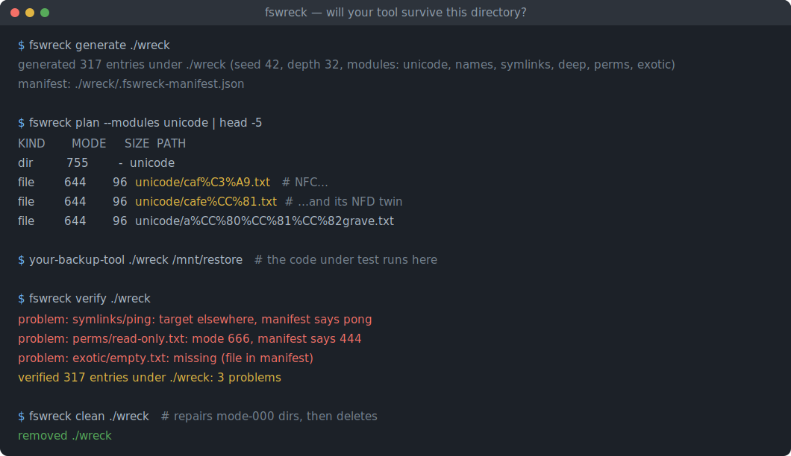
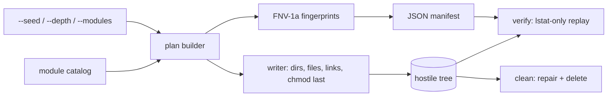

# fswreck

[English](README.md) | [中文](README.zh.md) | [日本語](README.ja.md)

[](LICENSE) [](Cargo.toml)  [](CONTRIBUTING.md)

**Open-source hostile-filesystem generator — deterministically builds adversarial file trees (unicode names, symlink cycles, deep nesting, odd permissions) as reusable, verifiable test fixtures.**



```bash
git clone https://github.com/JaydenCJ/fswreck.git && cargo install --path fswreck
```

## Why fswreck?

File-handling code always works on the developer's tidy home directory and then breaks in the field: on a photo library with NFC/NFD twin names, a node_modules with a symlink cycle, a scratch dir containing a file literally called `-rf`, or a backup source with a mode-000 directory. The usual answers both fall short — hand-made test directories cover the three cases their author remembered (and get silently mangled by git checkout, which cannot even represent a FIFO or an empty dir), while filesystem fuzzers find crashes but give you a different tree every run and nothing to assert against. fswreck sits in the gap: a curated catalog of 317 real-world failure modes, generated byte-identically from a seed, recorded in a JSON manifest that `fswreck verify` replays after your tool has run — so "survives a hostile tree" becomes a regression test, not an anecdote.

|  | fswreck | hand-made test dirs | fsstress (xfstests) | property-based fuzzing |
|---|---|---|---|---|
| Reproducible from a seed | yes, byte-identical | n/a (static) | no (random ops) | replay needs the framework |
| Curated known-nasty cases | 317 across 6 modules | whatever was remembered | no (random ops) | no (random) |
| Invalid UTF-8 / RTL / NFC-NFD names | yes | rarely survive git | no | encoder-dependent |
| Symlink cycles + ELOOP chains | yes | risky by hand | no | rarely modeled |
| mode-000 / write-only traps | yes, with safe teardown | break `rm -rf` | no | no |
| Post-run integrity check | `fswreck verify` | manual diff | no | assertion code |
| Dependencies | 0 (std only) | — | xfstests suite | a test framework |

## Features

- **One command, 317 traps** — `fswreck generate ./wreck` materializes six modules of curated failure modes: confusable unicode, flag-like names, symlink cycles, 2 KiB-deep paths, permission traps, and exotic inodes (FIFO, hardlinks, sparse, empty).
- **Deterministic to the byte** — file contents derive from `seed XOR fnv1a64(path)`; the same seed reproduces the identical tree and manifest on any machine, so fixtures are shareable and diffs are meaningful.
- **Verify after the damage** — the manifest records kind, mode, size, content fingerprint, link target and shared inodes; `fswreck verify` replays it and reports every deletion, mode drift, retarget, or unexpected extra file — exit code 1 means your tool broke something.
- **Never follows a link** — all checks are `lstat`/`readlink`, so cycles and escaping targets are inert, and a hostile manifest cannot make fswreck touch anything outside the fixture root.
- **Teardown that actually works** — `fswreck clean` repairs mode-000 directories before deleting (plain `rm -rf` gets stuck), and refuses to delete directories it did not generate unless forced.
- **Zero dependencies, zero network** — std-only Rust including the PRNG, hash and JSON parser; fswreck reads and writes local files and nothing else.

## Quickstart

Install (requires Rust 1.75+, Linux or macOS):

```bash
git clone https://github.com/JaydenCJ/fswreck.git && cargo install --path fswreck
```

Generate a hostile tree, run your tool over it, then check what survived:

```bash
fswreck generate ./wreck
your-backup-tool ./wreck /mnt/restore   # the code under test
fswreck verify ./wreck && echo "fixture intact"
```

Output (captured from a real run, seed 42):

```text
generated 317 entries under ./wreck (seed 42, depth 32, modules: unicode, names, symlinks, deep, perms, exotic)
manifest: ./wreck/.fswreck-manifest.json
verified 317 entries under ./wreck: OK
fixture intact
```

After tampering (a deleted file, a chmod, a retargeted link), `verify` names each casualty and exits 1:

```text
problem: symlinks/ping: target elsewhere, manifest says pong
problem: perms/read-only.txt: mode 666, manifest says 444
problem: exotic/empty.txt: missing (file in manifest)
verified 317 entries under ./wreck: 3 problems
```

Preview without touching disk, pick a subset, then tear down safely:

```bash
fswreck plan --modules unicode,symlinks | head
fswreck generate ./wreck2 --modules perms --seed 7
fswreck clean ./wreck2
```

## Wreck modules

Select with `--modules` (comma-separated); topology is curated and stable, only file bytes follow the seed.

| Module | Entries | What it wrecks |
|---|---|---|
| `unicode` | 16 | NFC/NFD twin names, RTL override (`‮txt.gpj`), zero-width chars, fullwidth/ligature confusables, a 255-byte name, invalid UTF-8 |
| `names` | 37 | `-rf`, `--help`, embedded newlines/tabs, glob and shell metacharacters, `CON`/`NUL`, trailing dots, a name that looks percent-encoded |
| `symlinks` | 64 | self-loop, A↔B cycle, dangling/absolute/escaping targets, directory loops, a 50-link chain that trips the kernel's 40-hop ELOOP limit |
| `deep` | 48 | `--depth` (default 32) nested directories plus a 2.2 KiB relative path built from 200-character components |
| `perms` | 13 | mode-000 file and directory, write-only/exec-only files, no-exec and no-read directories, sticky 1777 |
| `exotic` | 139 | FIFO, hardlink pair, 1 MiB sparse file, empty file and directory, dotfile and multi-extension names, a 128-file wide directory |

CLI options:

| Key | Default | Effect |
|---|---|---|
| `--seed <N>` | `42` | u64 content seed; changes bytes and fingerprints, never paths |
| `--modules <LIST>` | all six | Subset selection; catalog order, so flag order never matters |
| `--depth <N>` | `32` | Nesting depth of the `deep` module (1–512) |
| `--manifest <PATH>` | `<DIR>/.fswreck-manifest.json` | Write/read the manifest elsewhere (e.g. outside the tree) |
| `--force` | off | `generate`: allow non-empty target; `clean`: skip the manifest safety check |

Caveats: Unix-only by design (FIFOs, mode bits and non-UTF-8 names do not exist elsewhere). On macOS, generate onto a **case-sensitive** volume — default APFS collapses the case-collision and NFC/NFD pairs. Paths in all output are percent-encoded (see [docs/manifest-format.md](docs/manifest-format.md)); the `exotic` module shells out to POSIX `mkfifo(1)` rather than take a libc dependency.

## Architecture



## Roadmap

- [x] Core engine: six wreck modules (317 entries), seeded byte-identical generation, percent-encoded JSON manifest, lstat-only `verify` with mode relax/restore, permission-repairing `clean`, `plan`/`modules` preview — zero dependencies
- [ ] xattr / ACL module (user.* attributes, default ACLs, immutable flags where supported)
- [ ] `--profile` presets tuned per victim: backup tools, sync clients, archivers, dedupers
- [ ] tar export so fixtures survive checkout on filesystems that cannot represent them
- [ ] Case-collision detection at generate time on case-insensitive volumes
- [ ] Windows-hostile module behind a future Windows port (NTFS ADS, 260-char limit, reserved names enforced)

See the [open issues](https://github.com/JaydenCJ/fswreck/issues) for the full list.

## Contributing

Contributions are welcome — see [CONTRIBUTING.md](CONTRIBUTING.md), start with a [good first issue](https://github.com/JaydenCJ/fswreck/issues?q=is%3Aissue+is%3Aopen+label%3A%22good+first+issue%22) or open a [discussion](https://github.com/JaydenCJ/fswreck/discussions).

## License

[MIT](LICENSE)
