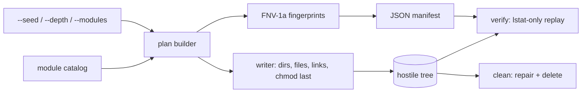

# fswreck

[English](README.md) | [中文](README.zh.md) | [日本語](README.ja.md)

[](LICENSE) [](Cargo.toml)  [](CONTRIBUTING.md)

**开源恶意文件系统生成器——以确定性方式构建对抗性文件树（Unicode 文件名、符号链接环、超深嵌套、诡异权限），作为可复用、可校验的测试夹具。**


```bash
git clone https://github.com/JaydenCJ/fswreck.git && cargo install --path fswreck
```

## 为什么选 fswreck？

处理文件的代码在开发者整洁的主目录里永远正常，一到现场就崩：照片库里出现 NFC/NFD 孪生文件名、node_modules 里藏着符号链接环、临时目录里有个文件名就叫 `-rf`、备份源里有个 mode-000 目录。常见的两种对策都不够用——手工搭的测试目录只覆盖作者记得住的那三种情况（而且会被 git checkout 悄悄毁掉，git 连 FIFO 和空目录都无法表示）；文件系统模糊测试能找崩溃，但每次生成的树都不同，也没有可断言的基准。fswreck 正好填上这个空隙：精心整理的 317 个真实世界故障模式目录，用一个种子逐字节复现，记录进 JSON 清单，你的工具跑完之后由 `fswreck verify` 回放校验——"扛得住恶意目录树"从此是回归测试，不再是轶事。

|  | fswreck | 手工测试目录 | fsstress (xfstests) | 基于属性的模糊测试 |
|---|---|---|---|---|
| 由种子可复现 | 是，逐字节一致 | 不适用（静态） | 否（随机操作） | 重放依赖框架 |
| 精选的已知恶性用例 | 6 模块共 317 个 | 只有作者记得的 | 否（随机操作） | 否（随机） |
| 非法 UTF-8 / RTL / NFC-NFD 文件名 | 有 | 很难在 git 里存活 | 无 | 取决于编码器 |
| 符号链接环 + ELOOP 链 | 有 | 手工制作风险大 | 无 | 很少建模 |
| mode-000 / 只写陷阱 | 有，且能安全拆除 | 会卡死 `rm -rf` | 无 | 无 |
| 跑完后的完整性检查 | `fswreck verify` | 手工 diff | 无 | 要自己写断言 |
| 依赖 | 0（仅 std） | — | xfstests 套件 | 一个测试框架 |

## 特性

- **一条命令，317 个陷阱** — `fswreck generate ./wreck` 生成六大模块的精选故障模式：易混淆 Unicode、旗标形文件名、符号链接环、2 KiB 深路径、权限陷阱，以及奇异 inode（FIFO、硬链接、稀疏、空）。
- **逐字节确定性** — 文件内容由 `seed XOR fnv1a64(path)` 推导；同一种子在任何机器上复现完全相同的树和清单，夹具可以分享，diff 有意义。
- **破坏之后可校验** — 清单记录类型、权限、大小、内容指纹、链接目标与共享 inode；`fswreck verify` 回放并报告每一处删除、权限漂移、链接改向或意外多出的文件——退出码 1 意味着你的工具弄坏了什么。
- **绝不跟随链接** — 所有检查都用 `lstat`/`readlink`，环和逃逸目标因此无害，恶意清单也无法让 fswreck 触碰夹具根之外的任何东西。
- **真正可用的拆除** — `fswreck clean` 先修复 mode-000 目录再删除（普通 `rm -rf` 会卡住），且拒绝删除不是它生成的目录，除非强制。
- **零依赖、零网络** — 纯 std Rust，连 PRNG、哈希和 JSON 解析器都自带；fswreck 只读写本地文件，别的什么都不做。

## 快速上手

安装（需要 Rust 1.75+，Linux 或 macOS）：

```bash
git clone https://github.com/JaydenCJ/fswreck.git && cargo install --path fswreck
```

生成恶意目录树，让你的工具跑一遍，再看什么活了下来：

```bash
fswreck generate ./wreck
your-backup-tool ./wreck /mnt/restore   # the code under test
fswreck verify ./wreck && echo "fixture intact"
```

输出（真实运行截取，种子 42）：

```text
generated 317 entries under ./wreck (seed 42, depth 32, modules: unicode, names, symlinks, deep, perms, exotic)
manifest: ./wreck/.fswreck-manifest.json
verified 317 entries under ./wreck: OK
fixture intact
```

被篡改后（删了一个文件、chmod 了一下、改了链接指向），`verify` 逐一点名并以 1 退出：

```text
problem: symlinks/ping: target elsewhere, manifest says pong
problem: perms/read-only.txt: mode 666, manifest says 444
problem: exotic/empty.txt: missing (file in manifest)
verified 317 entries under ./wreck: 3 problems
```

不碰磁盘先预览、挑子集、然后安全拆除：

```bash
fswreck plan --modules unicode,symlinks | head
fswreck generate ./wreck2 --modules perms --seed 7
fswreck clean ./wreck2
```

## 破坏模块

用 `--modules`（逗号分隔）选择；拓扑是精选且稳定的，只有文件字节随种子变化。

| 模块 | 条目数 | 破坏什么 |
|---|---|---|
| `unicode` | 16 | NFC/NFD 孪生名、RTL 覆盖（`‮txt.gpj`）、零宽字符、全角/连字易混淆名、255 字节文件名、非法 UTF-8 |
| `names` | 37 | `-rf`、`--help`、内嵌换行/制表符、glob 与 shell 元字符、`CON`/`NUL`、尾随点号、看起来像百分号编码的名字 |
| `symlinks` | 64 | 自环、A↔B 环、悬空/绝对/逃逸目标、目录回环、触发内核 40 跳 ELOOP 上限的 50 级链条 |
| `deep` | 48 | `--depth`（默认 32）层嵌套目录，外加由 200 字符组件拼成的 2.2 KiB 相对路径 |
| `perms` | 13 | mode-000 文件和目录、只写/只执行文件、无执行位和无读取位目录、粘滞位 1777 |
| `exotic` | 139 | FIFO、硬链接对、1 MiB 稀疏文件、空文件和空目录、点开头及多重扩展名的名字、128 个文件的宽目录 |

CLI 选项：

| 键 | 默认值 | 效果 |
|---|---|---|
| `--seed <N>` | `42` | u64 内容种子；改变字节和指纹，绝不改变路径 |
| `--modules <LIST>` | 全部六个 | 子集选择；按目录顺序生效，旗标顺序无关紧要 |
| `--depth <N>` | `32` | `deep` 模块的嵌套深度（1–512） |
| `--manifest <PATH>` | `<DIR>/.fswreck-manifest.json` | 把清单读写到别处（例如树外） |
| `--force` | 关 | `generate`：允许非空目标；`clean`：跳过清单安全检查 |

注意事项：设计上仅支持 Unix（FIFO、权限位和非 UTF-8 文件名在别处不存在）。在 macOS 上请生成到**区分大小写**的卷——默认 APFS 会合并大小写冲突对和 NFC/NFD 对。所有输出中的路径都经过百分号编码（见 [docs/manifest-format.md](docs/manifest-format.md)）；`exotic` 模块调用 POSIX 的 `mkfifo(1)` 而不是引入 libc 依赖。

## 架构



## 路线图

- [x] 核心引擎：六大破坏模块（317 条目）、种子级逐字节生成、百分号编码 JSON 清单、只用 lstat 的 `verify`（含权限临时放宽/恢复）、修复权限的 `clean`、`plan`/`modules` 预览——零依赖
- [ ] xattr / ACL 模块（user.* 属性、默认 ACL、支持时的 immutable 标志）
- [ ] 针对受害者调优的 `--profile` 预设：备份工具、同步客户端、归档器、去重器
- [ ] tar 导出，让夹具在无法表示它们的文件系统上也能存活 checkout
- [ ] 在不区分大小写的卷上生成时检测大小写冲突
- [ ] 面向未来 Windows 移植的 Windows 恶意模块（NTFS ADS、260 字符上限、强制保留名）

完整列表见 [open issues](https://github.com/JaydenCJ/fswreck/issues)。

## 参与贡献

欢迎贡献——请阅读 [CONTRIBUTING.md](CONTRIBUTING.md)，从一个 [good first issue](https://github.com/JaydenCJ/fswreck/issues?q=is%3Aissue+is%3Aopen+label%3A%22good+first+issue%22) 开始，或发起一个 [discussion](https://github.com/JaydenCJ/fswreck/discussions)。

## 许可证

[MIT](LICENSE)
